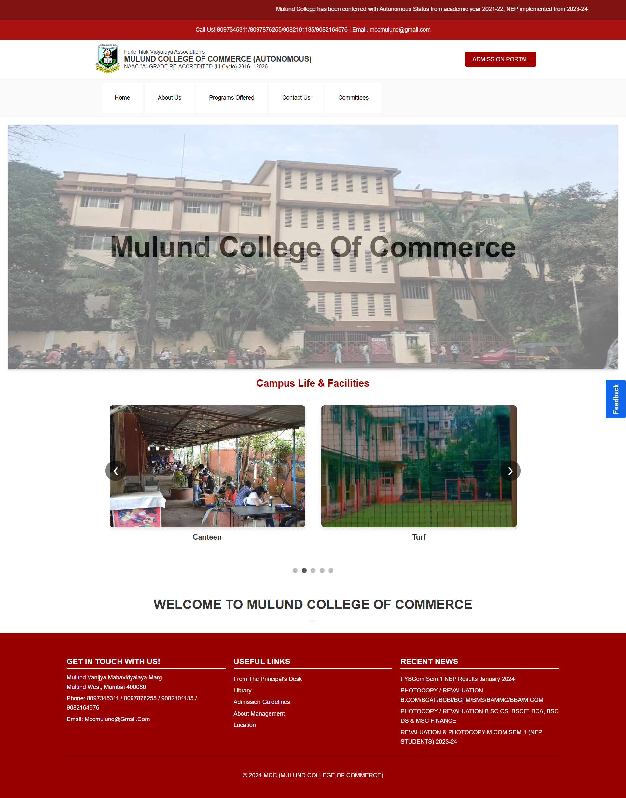
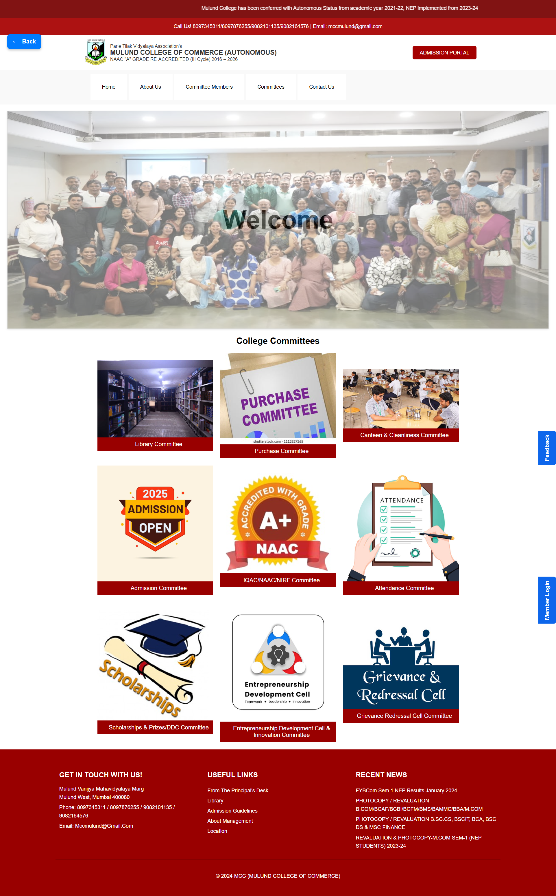
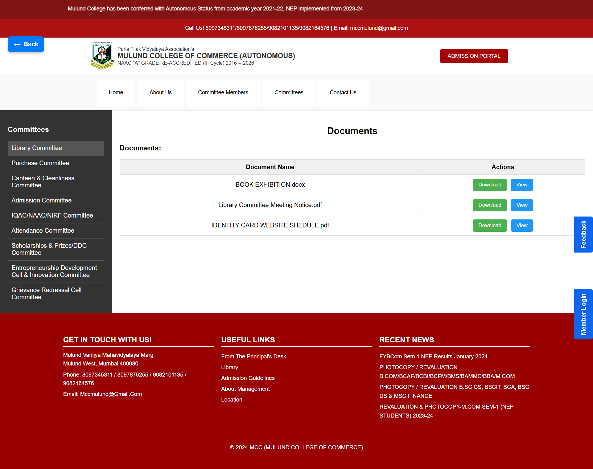
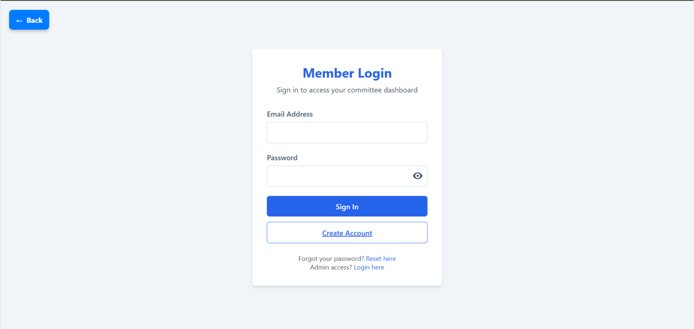
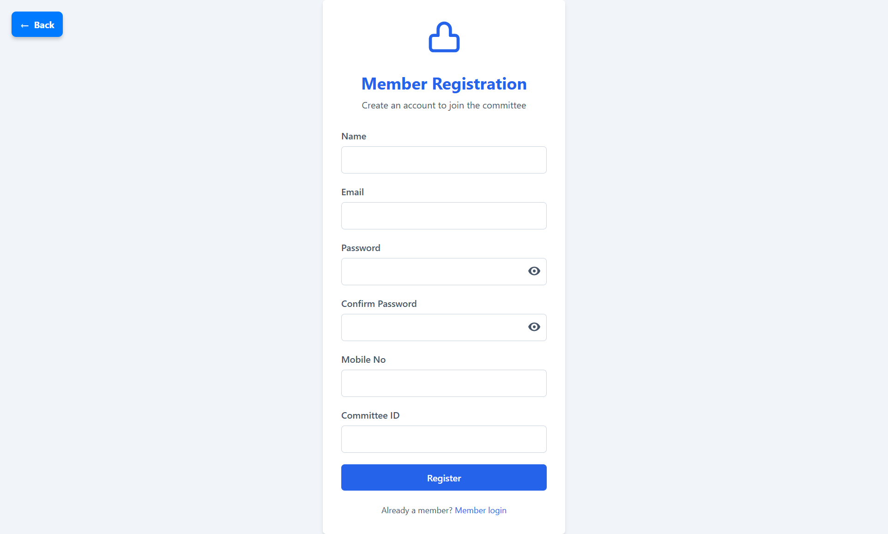

# College Committee Management System (CCMS)

A web-based College Committee Management System designed to manage committees, members, and official documents/notices in a structured and secure way.  
The system includes role-based access for Admin and Committee Members with an approval workflow.

---

## 📌 Project Description

The College Committee Management System (CCMS) is a PHP–MySQL based web application.

- A **College Main Website** displays general information and provides access to the **Committee Website**
- The **Committee Website** displays committee details, members, and downloadable documents/notices
- Committee Members can register and manage data **only after Admin approval**
- Admin verifies and approves new member registrations through a secure Admin Panel

This project is designed to run on **localhost using XAMPP**.

---

## ✨ Key Features

- College main website with committee navigation
- Committee-wise member listing
- Committee-wise documents and notices (View & Download)
- Secure member login & registration
- Admin approval system for new members
- Member dashboard to:
  - Manage committees
  - Manage members
  - Upload, view, and delete documents/notices
- File validation for uploads (PDF, DOCX, JPG, PNG, JPEG)
- Logout & session-based access control

---

## 🛠️ Tech Stack

- **Frontend:** HTML, CSS, JavaScript
- **Backend:** PHP
- **Database:** MySQL
- **Server:** XAMPP (Apache + MySQL)
- **Editor:** VS Code

---

## 📸 Project Screenshots

### 1️⃣ College Website – Main Page

### 2️⃣ Committee Website – Home Page

### 3️⃣ Committee Members Page

### 4️⃣ Committees & Documents Page

### 5️⃣ Member Login Page

### 6️⃣ Member Registration Page

### 7️⃣ Admin Panel (Approval System)

### 8️⃣ Member Management Dashboard

---

## ▶️ How to Run the Project (Localhost)

1. Install **XAMPP**
2. Start **Apache** and **MySQL**
3. Copy the project folder into:
   xampp/htdocs/
4. Open browser and go to:
   http://localhost/your_project_folder_name

---

## 🗄️ Database Setup

1. Open **phpMyAdmin**
   http://localhost/phpmyadmin
2. Create a database (or use the provided SQL file)
3. Import the SQL file available in the project folder:
   /database/college_committee_db.sql
4. Database tables will be created automatically

---

## 🎥 Project Demo Video

▶️ Watch the complete project walkthrough here:  
https://drive.google.com/file/d/1-CX7pLxzxNO1KtUxo9fcDh3pubeDKt8Z/view?usp=drivesdk

---

## ⚠️ Notes

- This project is intended to run on **localhost**
- Database credentials can be modified in the `db.php` file if required
- Admin approval is mandatory for committee member access
- admin username is admin and password is admin123

---

## 👨‍💻 Author

**Om Padwal**  
B.Sc IT | Data & Web Projects  
